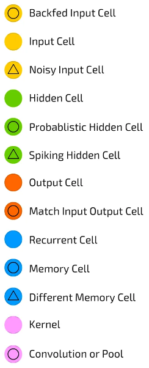
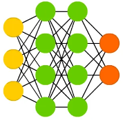

# deepforge

A python object oriented library to model deep neural networks based on Keras/Tensorflow.

[](LICENSE)

## Version

The current version is 0.0.3.

## Changelog

11.10.2023 - Version 0.0.3: Integration of a fully functional Convolutional Neural Network and Recurrent Neural Network classes.

10.10.2023 - Version 0.0.2: Integration of a fully functional multivariate Deep Neural Network class.

## Overview

deepforge is a Python object-oriented library built on top of Keras and TensorFlow for simplifying the creation and training of deep neural networks. It provides a user-friendly interface for designing, configuring, and training neural network models, making it easier for developers and researchers to work with deep learning. Next versions of the library should include support for other deep learning frameworks (such as PyTorch, Theano, Caffe, etc.).

## Features

- High-level API for defining neural network architectures.
- Modular and extensible design for easy customization.
- Integration with Keras and TensorFlow for efficient training and deployment.
- Support for a variety of neural network types, including feed-forward, convolutional, recurrent, and more.
- Built-in utilities for data preprocessing, evaluation, and visualization.

## Installation

You can install your library using pip:

```bash
pip install deepforge
```

This will install the library with full support for tensorflow-gpu.

## Quick Start

In the following sections, we will refer to the Deep Neural Network schemes reported in [The mostly complete chart of neural networks explained](https://towardsdatascience.com/the-mostly-complete-chart-of-neural-networks-explained-3fb6f2367464) by Fjodor van Veen. The reference chart is reported here:



### Multivariate Deep Neural Network (`multivariateDNN`)
The generic scheme of a Multivariate Deep Neural Network is:



Here's a simple example of how to deepforge a simple Deep Neural Network via the `multivariateDNN` class:

```python
import numpy as np
# Import the deepforge library
import deepforge as df

# Initialize the environment
df.initialize(CPU=20, GPU=1, VERBOSE='2', NPARRAYS=True)

# Make an instance of a multivariate DNN
mDnn = df.multivariateDNN(name="Simple DNN", inputN=1)

# Set inputs, inner layers and out layers
mDnn.setInputs([{'shape': (2,), 'name': 'Input layer'}])
mDnn.setLayers([[{'units': 16, 'activation': 'elu'}, {'units': 16, 'activation': 'elu'}, {'units': 16, 'activation': 'elu'}, {'units': 3, 'activation': 'linear'}]])
mDnn.setOutLayers([{'units': 1, 'activation': 'linear'}])

# Configure the model
mDnn.setModelConfiguration(optimizer='adam', loss='mse')

# Build the model and print the summary
mDnn.build()
mDnn.summary()

# Train the model
x1 = np.array([2,3,5,6,7], dtype=np.float32)
x2 = np.array([1,2,4,5,6], dtype=np.float32)
X1 = np.array([x1,x2], dtype=np.float32).T
y  = np.array([3,4,6,7,8], dtype=np.float32)

mDnn.fit(x=[X1], y=y, epochs=20, shuffle=True, verbose=0)

# Save the model
mDnn.save('simpleDNN',tflite=False)

# Make a prediction with the model
x1 = np.array([8], dtype=np.float32)
x2 = np.array([7], dtype=np.float32)
X1 = np.array([x1,x2], dtype=np.float32).T
y = mDnn.predict([X1])
print(y.numpy())

# Load the model
mDnnCopy = df.multivariateDNN(name="simple DNN 2")
mDnnCopy.load("simpleDNN")
```

The output of the previous snippet is:

```
[DF] Building model...
[DF] Model built!
Model: "SimpleDNN"
_________________________________________________________________
 Layer (type)                Output Shape              Param #   
=================================================================
 Input layer (InputLayer)    [(None, 2)]               0         
                                                                 
 dense_20 (Dense)            (None, 16)                48        
                                                                 
 dense_21 (Dense)            (None, 16)                272       
                                                                 
 dense_22 (Dense)            (None, 16)                272       
                                                                 
 dense_23 (Dense)            (None, 3)                 51        
                                                                 
 dense_24 (Dense)            (None, 1)                 4         
                                                                 
=================================================================
Total params: 647
Trainable params: 647
Non-trainable params: 0
_________________________________________________________________
[DF] Saving model...
[DF] Model saved!
[[1.0306408]]
[DF] Loading model...
[DF] Loaded!
```

The same `multivariateDNN` class can be used to build a more complex DNN model with a custom loss function:

```python
# DNN with 2 input layers and custom loss function example
import numpy as np
from keras.losses import MeanSquaredError
# Import the deepforge library
import deepforge as df

# Initialize the environment
df.initialize(CPU=20, GPU=1, VERBOSE='2', NPARRAYS=True)

# Define a custom loss function
def custom_loss(y_true, y_pred):
  mse = MeanSquaredError()
  return mse(y_true, y_pred)

# Make an instance of a multivariate DNN
mDnn2 = df.multivariateDNN(name="multivariate DNN", inputN=2)

# Set inputs, inner layers and out layers
mDnn2.setInputs([{'shape': (2,), 'name': 'inputLayer1'}, {'shape': (2,), 'name': 'inputLayer2'}])

innerLayers = [[{'units': 32, 'activation': 'elu'}, {'units': 16, 'activation': 'elu'}, {'units': 8, 'activation': 'elu'}, {'units': 3, 'activation': 'linear'}]]
innerLayers.append([{'units': 32, 'activation': 'elu'}, {'units': 16, 'activation': 'elu'}, {'units': 8, 'activation': 'elu'}, {'units': 3, 'activation': 'linear'}])
mDnn2.setLayers(innerLayers)

outputLayers = [{'units': 32, 'activation': 'elu'}, {'units': 1, 'activation': 'linear'}]
mDnn2.setOutLayers(outputLayers)

# Configure the model
mDnn2.setModelConfiguration(optimizer='adam', loss=custom_loss)

# Build the model and print the summary
mDnn2.build()
mDnn2.summary()

# Train the model
x1 = np.array([0.2,0.3,0.5,0.6,0.7], dtype=np.float32)
x2 = np.array([1.1,1.2,1.4,1.5,1.6], dtype=np.float32)
X1 = np.array([x1,x2], dtype=np.float32).T
x3 = np.array([0.2,0.3,0.5,0.6,0.7], dtype=np.float32)
x4 = np.array([1.1,1.2,1.4,1.5,1.6], dtype=np.float32)
X2 = np.array([x3,x4], dtype=np.float32).T
y  = np.array([3.0,4.0,6.0,7.0,8.0], dtype=np.float32)

mDnn2.fit(x=[X1,X2], y=y, epochs=50, shuffle=True, verbose=0)

# Save the model
mDnn2.save('multivariateDNN',tflite=False)

# Make a prediction with the model
x1 = np.array([0.4], dtype=np.float32)
x2 = np.array([1.3], dtype=np.float32)
X1 = np.array([x1,x2], dtype=np.float32).T
x3 = np.array([0.4], dtype=np.float32)
x4 = np.array([1.3], dtype=np.float32)
X2 = np.array([x3,x4], dtype=np.float32).T
y = mDnn2.predict([X1,X2])
print(y.numpy())

# Load the model with the custom loss function
mDnn2Copy = df.multivariateDNN(name="multivariate DNN 2")
mDnn2Copy.load("multivariateDNN", custom_objects = {'custom_loss': custom_loss})
```

The output of the previous snippet is:

```
[DF] Building model...
[DF] Model built!
Model: "multivariateDNN"
__________________________________________________________________________________________________
 Layer (type)                   Output Shape         Param #     Connected to                     
==================================================================================================
 inputLayer1 (InputLayer)       [(None, 2)]          0           []                               
                                                                                                  
 inputLayer2 (InputLayer)       [(None, 2)]          0           []                               
                                                                                                  
 dense_25 (Dense)               (None, 32)           96          ['inputLayer1[0][0]']            
                                                                                                  
 dense_29 (Dense)               (None, 32)           96          ['inputLayer2[0][0]']            
                                                                                                  
 dense_26 (Dense)               (None, 16)           528         ['dense_25[0][0]']               
                                                                                                  
 dense_30 (Dense)               (None, 16)           528         ['dense_29[0][0]']               
                                                                                                  
 dense_27 (Dense)               (None, 8)            136         ['dense_26[0][0]']               
                                                                                                  
 dense_31 (Dense)               (None, 8)            136         ['dense_30[0][0]']               
                                                                                                  
 dense_28 (Dense)               (None, 3)            27          ['dense_27[0][0]']               
                                                                                                  
 dense_32 (Dense)               (None, 3)            27          ['dense_31[0][0]']               
                                                                                                  
 concatenate_1 (Concatenate)    (None, 6)            0           ['dense_28[0][0]',               
                                                                  'dense_32[0][0]']               
                                                                                                  
 dense_33 (Dense)               (None, 32)           224         ['concatenate_1[0][0]']          
                                                                                                  
 dense_34 (Dense)               (None, 1)            33          ['dense_33[0][0]']               
                                                                                                  
==================================================================================================
Total params: 1,831
Trainable params: 1,831
Non-trainable params: 0
__________________________________________________________________________________________________
[DF] Saving model...
[DF] Model saved!
[[6.0725203]]
[DF] Loading model...
[DF] Loaded!
```

For more detailed usage and examples, please refer to the documentation.

### Convolutional Neural Network (`CNN`)
The generic scheme of a Convolutional Neural Network is reported here:


Here's a simple example of how to deepforge a simple Convolutional Neural Network via the `CNN` class and fitting the model with the MNIST dataset:

```python
# Convolutional Neural Network example with MNIST dataset training and validation
import numpy as np
# Import the deepforge library
import deepforge as df
from keras.datasets import mnist
from keras.utils import to_categorical

# Initialize the environment
df.initialize(CPU=20, GPU=1, VERBOSE='2', NPARRAYS=True)

# Make an instance of a CNN
cnn = df.CNN(name="Simple CNN", inputN=1)

# Set inputs, inner layers and out layers
cnn.setInputs([{'shape': (28, 28, 1), 'name': 'Input Layer'}])
cnn.setConvLayers([[{'filters': 32, 'kernel_size': (3, 3), 'activation': 'relu'},{'filters': 64, 'kernel_size': (3, 3), 'activation': 'relu'},{'filters': 64, 'kernel_size': (3, 3), 'activation': 'relu'}]])
cnn.setPoolLayers([[{'pool_size': (2,2)},{'pool_size': (2,2)}]])
cnn.setOutLayers([{'units': 64, 'activation': 'relu'},{'units': 10, 'activation': 'softmax'}])

# Configure the model
cnn.setModelConfiguration(optimizer='adam', loss='categorical_crossentropy', metrics=['accuracy'])

# Build the model and print the summary
cnn.build()
cnn.summary()

# Load the MNIST dataset and preprocess it
(train_images, train_labels), (test_images, test_labels) = mnist.load_data()
train_images = train_images.reshape((60000, 28, 28, 1))
test_images = test_images.reshape((10000, 28, 28, 1))
train_images = train_images.astype('float32') / 255
test_images = test_images.astype('float32') / 255
train_labels = to_categorical(train_labels)
test_labels = to_categorical(test_labels)

# Fit the model
cnn.fit(x=train_images, y=train_labels, epochs=5, batch_size=64)

# Save the model
cnn.save('CNN',tflite=False)

# Get the Keras model and run a test to evaluate accuracy
cnnModel = cnn.getModel()

test_loss, test_acc = cnnModel.evaluate(test_images, test_labels)
print("Test accuracy:", test_acc)
```

The output of the previous code snippet is reported here:
```
[DF] Building model...
[DF] Model built!
Model: "SimpleCNN"
_________________________________________________________________
 Layer (type)                Output Shape              Param #   
=================================================================
 Input Layer (InputLayer)    [(None, 28, 28, 1)]       0         
                                                                 
 conv2d_6 (Conv2D)           (None, 26, 26, 32)        320       
                                                                 
 max_pooling2d_4 (MaxPooling  (None, 13, 13, 32)       0         
 2D)                                                             
                                                                 
 conv2d_7 (Conv2D)           (None, 11, 11, 64)        18496     
                                                                 
 max_pooling2d_5 (MaxPooling  (None, 5, 5, 64)         0         
 2D)                                                             
                                                                 
 conv2d_8 (Conv2D)           (None, 3, 3, 64)          36928     
                                                                 
 flatten_2 (Flatten)         (None, 576)               0         
                                                                 
 dense_4 (Dense)             (None, 64)                36928     
                                                                 
 dense_5 (Dense)             (None, 10)                650       
                                                                 
=================================================================
Total params: 93,322
Trainable params: 93,322
Non-trainable params: 0
_________________________________________________________________
Epoch 1/5
938/938 [==============================] - 6s 5ms/step - loss: 0.1780 - accuracy: 0.9445
Epoch 2/5
938/938 [==============================] - 6s 6ms/step - loss: 0.0501 - accuracy: 0.9843
Epoch 3/5
938/938 [==============================] - 5s 6ms/step - loss: 0.0365 - accuracy: 0.9886
Epoch 4/5
938/938 [==============================] - 6s 6ms/step - loss: 0.0273 - accuracy: 0.9916
Epoch 5/5
938/938 [==============================] - 6s 6ms/step - loss: 0.0226 - accuracy: 0.9930
313/313 [==============================] - 1s 4ms/step - loss: 0.0281 - accuracy: 0.9911
Test accuracy: 0.991100013256073
[DF] Saving model...
[DF] Model saved!
```

### Recurrent Neural Network (`RNN`)
The generic scheme of a Recurrent Neural Network is reported here:


Here's a simple example of how to deepforge a simple Recurrent Neural Network via the `RNN` class:

```python
# Simple Recurrent Neural Network example

# Make an instance of a RNN
rnn = df.RNN(name="Simple RNN", inputN=1)

# Set inputs, inner layers and out layers
rnn.setInputs([{'shape': (1,2), 'name': 'Input layer'}])
rnn.setRecurrentLayers([[{'units': 500}]])
rnn.setOutLayers([{'units': 1, 'activation': 'linear'}])

# Configure the model
rnn.setModelConfiguration(optimizer='adam', loss='categorical_crossentropy', metrics=['accuracy'])

# Build the model and print the summary
rnn.build()
rnn.summary()

################################################
################################################
################################################

# Another RNN example with 3 stacked LSTM layers
rnn2 = df.RNN(name="Stacked RNN")

# Set inputs, inner layers and out layers
rnn2.setInputs([{'shape': (6,2), 'name': 'Input layer'}])
rnn2.setRecurrentLayers([[{'units': 500, 'return_sequences': True},{'units': 500, 'return_sequences': True},{'units': 500}]])
rnn2.setOutLayers([{'units': 1, 'activation': 'linear'}])

# Configure the model
rnn2.setModelConfiguration(optimizer='adam', loss='categorical_crossentropy', metrics=['accuracy'])

# Build the model and print the summary
rnn2.build()
rnn2.summary()
```

The output for the previous code is:

```
[DF] Building model...
[DF] Model built!
Model: "SimpleRNN"
_________________________________________________________________
 Layer (type)                Output Shape              Param #   
=================================================================
 Input layer (InputLayer)    [(None, 1, 2)]            0         
                                                                 
 cu_dnnlstm_4 (CuDNNLSTM)    (None, 500)               1008000   
                                                                 
 dense_2 (Dense)             (None, 1)                 501       
                                                                 
=================================================================
Total params: 1,008,501
Trainable params: 1,008,501
Non-trainable params: 0
_________________________________________________________________
[DF] Building model...
[DF] Model built!


Model: "StackedRNN"
_________________________________________________________________
 Layer (type)                Output Shape              Param #   
=================================================================
 Input layer (InputLayer)    [(None, 6, 2)]            0         
                                                                 
 cu_dnnlstm_5 (CuDNNLSTM)    (None, 6, 500)            1008000   
                                                                 
 cu_dnnlstm_6 (CuDNNLSTM)    (None, 6, 500)            2004000   
                                                                 
 cu_dnnlstm_7 (CuDNNLSTM)    (None, 500)               2004000   
                                                                 
 dense_3 (Dense)             (None, 1)                 501       
                                                                 
=================================================================
Total params: 5,016,501
Trainable params: 5,016,501
Non-trainable params: 0
_________________________________________________________________
```

### Convolutional Recurrent Neural Network (`CRNN`)
Here's a simple example of how to deepforge a simple Convolutional Recurrent Neural Network via the `CRNN` class:

```python
# Convolutional Recurrent Neural Network example

# Make an instance of a CRNN
crnn = df.CRNN(name="Simple CRNN", inputN=1)

# Set inputs, inner layers and out layers
crnn.setInputs([{'shape': (3,3,1), 'name': 'Input Layer'}])
crnn.setConvLayers([[{'filters': 32, 'kernel_size': (2,2), 'activation': 'relu'},{'filters': 64, 'kernel_size': (2,2), 'activation': 'relu', 'padding': 'same'}]])
crnn.setPoolLayers([[{'pool_size': (2,2)},{'pool_size': (2,2)}]])
crnn.setRecurrentLayers([{'units': 500}])
crnn.setOutLayers([{'units': 1, 'activation': 'linear'}])

# Configure the model
crnn.setModelConfiguration(optimizer='adam', loss='categorical_crossentropy', metrics=['accuracy'])

# Build the model and print the summary
crnn.build()
crnn.summary()

# Save the model
crnn.save('CRNN')
```

The output of the previous code snippet is reported here:
```
[DF] Building model...
[DF] Model built!
Model: "SimpleCRNN"
_________________________________________________________________
 Layer (type)                Output Shape              Param #   
=================================================================
 Input Layer (InputLayer)    [(None, 3, 3, 1)]         0         
                                                                 
 conv2d_2 (Conv2D)           (None, 2, 2, 32)          160       
                                                                 
 max_pooling2d_1 (MaxPooling  (None, 1, 1, 32)         0         
 2D)                                                             
                                                                 
 conv2d_3 (Conv2D)           (None, 1, 1, 64)          8256      
                                                                 
 flatten_1 (Flatten)         (None, 64)                0         
                                                                 
 reshape_1 (Reshape)         (None, 64, 1)             0         
                                                                 
 cu_dnnlstm_1 (CuDNNLSTM)    (None, 500)               1006000   
                                                                 
 dense_1 (Dense)             (None, 1)                 501       
                                                                 
=================================================================
Total params: 1,014,917
Trainable params: 1,014,917
Non-trainable params: 0
_________________________________________________________________
[DF] Saving model...
[DF] Model saved!
```


## Documentation

Check out the full documentation for [Keras](https://keras.io/api/) and [Tensorflow](https://www.tensorflow.org/api_docs) for in-depth information on how to use the library.

## License

This project is licensed under the GNU GPL License - see the [LICENSE](LICENSE) file for details.

## Contact

If you have any questions or feedback, feel free to reach out to [me](mailto:fabrizio.romanelli@gmail.com).
